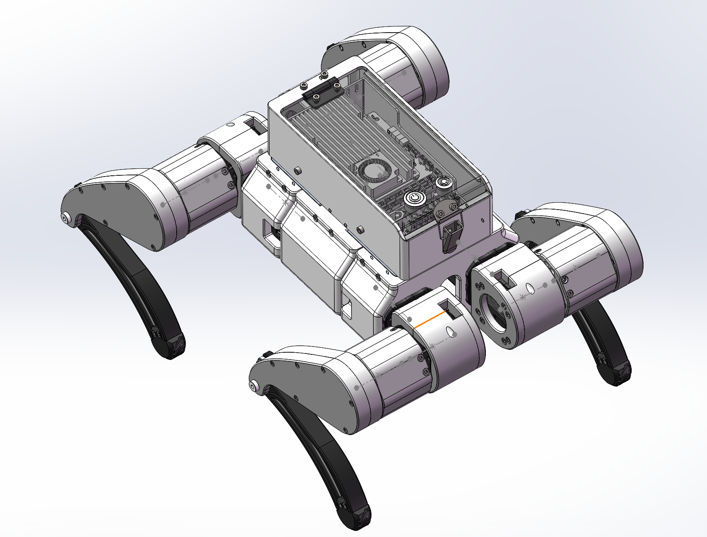
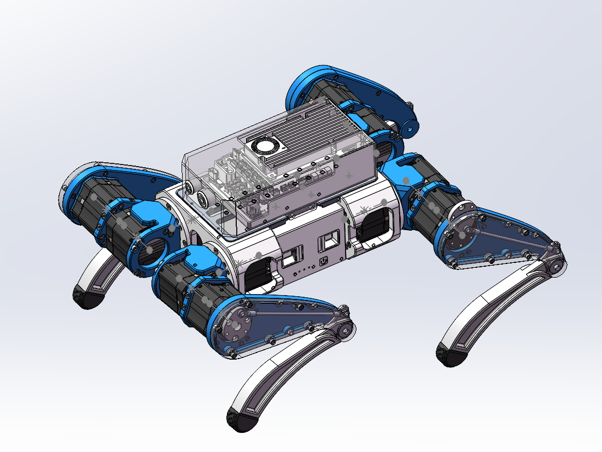
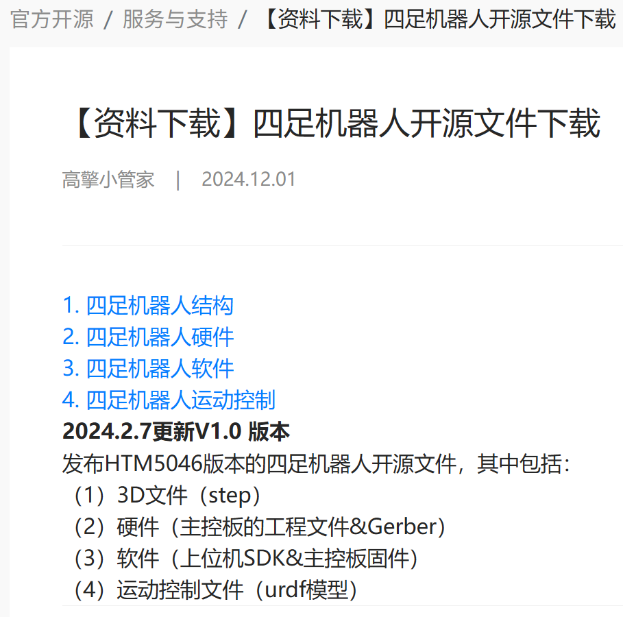

<p align="center">
  
</p>

<h1 align="center">HTDW4438-OpenDog</h1>

<p align="center">
  <b>简体中文</b> | <a href="README_EN.md">English</a>
</p>

<p align="center">
  全栈开源四足机器人项目：机械/URDF → Isaac Gym 强化学习训练 → Sim2Real 部署
</p>

<p align="center">
  <a href="#仓库结构">仓库结构</a> ·
  <a href="https://github.com/Lain-Ego0/HTDW4438_Isaacgym">训练框架</a> ·
  <a href="https://github.com/Lain-Ego0/LeggedWiki">LeggedWiki</a> ·
  <a href="#参考平台高擎机电-htm5046">高擎机电 HTM5046</a>
</p>

---

## 目录

- [目录](#目录)
- [项目简介](#项目简介)
- [项目亮点](#项目亮点)
- [图片预览](#图片预览)
- [仓库结构](#仓库结构)
- [相关仓库](#相关仓库)
- [快速开始](#快速开始)
  - [1) 查看/使用 URDF](#1-查看使用-urdf)
  - [2) 强化学习训练](#2-强化学习训练)
  - [3) 实机 SDK 与脚本](#3-实机-sdk-与脚本)
- [参考平台：高擎机电 HTM5046](#参考平台高擎机电-htm5046)
- [引用与致谢](#引用与致谢)

## 项目简介

**HTDW4438-OpenDog** 是一个全栈开源四足机器人项目，覆盖从机械结构与 URDF 建模到强化学习（RL）运动控制的完整链路，并提供 Sim2Real 的部署接口与脚本。

本项目是在 **高擎机电（HighTorque）HTM5046** 开源平台基础上进行的针对性迭代与优化（结构/URDF/训练与部署流程适配）。

## 项目亮点

- **敏捷运动能力**：以 **HIMloco**（Hybrid Internal Model）等思想为参考，面向稳定、鲁棒的运动控制。
- **高性能训练**：基于 **NVIDIA Isaac Gym** 的 GPU 加速强化学习训练流程。
- **Sim-to-Real**：配套 `livelybot_sdk` 与部署脚本，打通仿真到实机的链路。
- **资料沉淀**：配套知识库与文档仓库，便于快速上手与排障。

## 图片预览

<p align="center">
  
  
</p>

## 仓库结构

```text
HTDW4438-OpenDog
├── 1.Hardware/               # 机械文件、URDF、网格等
│   └── htdw_4438/             # URDF 包（meshes/、urdf/、launch/）
├── 2.Software/
│   └── livelybot_sdk/         # 电机控制与通信 SDK（含常用脚本）
├── 3.Document/                # BOM、手册、STEP 等资料
├── 4.Paper/                   # 参考论文（HIMloco 等）
├── 5.Images/                  # 项目渲染图
└── assets/                    # README 相关素材
```

## 相关仓库

- **训练框架（Isaac Gym）**：[`HTDW4438_Isaacgym`](https://github.com/Lain-Ego0/HTDW4438_Isaacgym)
- **配套知识库**：[`LeggedWiki`](https://github.com/Lain-Ego0/LeggedWiki)
- **技术笔记（飞书 Wiki）**：<https://wcn9j5638vrr.feishu.cn/wiki/space/757098375279517715>

## 快速开始

### 1) 查看/使用 URDF

- URDF：`1.Hardware/htdw_4438/urdf/htdw_4438.urdf`
- 网格：`1.Hardware/htdw_4438/meshes/`

### 2) 强化学习训练

训练与部署相关代码已迁移到：[`HTDW4438_Isaacgym`](https://github.com/Lain-Ego0/HTDW4438_Isaacgym)。

最小环境安装示例（以训练仓库为准）：

```bash
git clone https://github.com/Lain-Ego0/HTDW4438_Isaacgym.git
cd HTDW4438_Isaacgym
conda env create -f HTDW4438.yml
conda activate HTDW4438
pip install -e rsl_rl
pip install -e legged_gym
```

### 3) 实机 SDK 与脚本

- SDK 目录：`2.Software/livelybot_sdk/`
- 常用脚本：
  - `2.Software/livelybot_sdk/motor_set_zero.sh`（电机归零/校准）
  - `2.Software/livelybot_sdk/canboard_update.sh`（CAN 板固件更新）
  - 更多说明见：`2.Software/livelybot_sdk/readme.md`

> 提示：涉及电机上电与归零前，建议先将机身抬空/卸载，确认急停与限位策略，避免误动作造成损坏。

## 参考平台：高擎机电 HTM5046

- 高擎机电（HighTorque）官网：<https://www.hightorque.cn/>
- HighTorque 英文站点：<https://www.hightorquerobotics.com/>
- 四足开源资料下载（含结构/硬件/软件/运动控制/URDF 等）：<https://www.hightorque.cn/ziliaoxiazai/sizujqrosxz.html>
- 官方开源资料包通常包含：结构 3D 文件（STEP）、硬件工程文件（含 Gerber）、软件（SDK 与固件）、运动控制相关文件（URDF）等。

<p align="center">
  
</p>

## 引用与致谢

- 本作品于高擎机电实习期间完成，感谢高擎机电的支持
