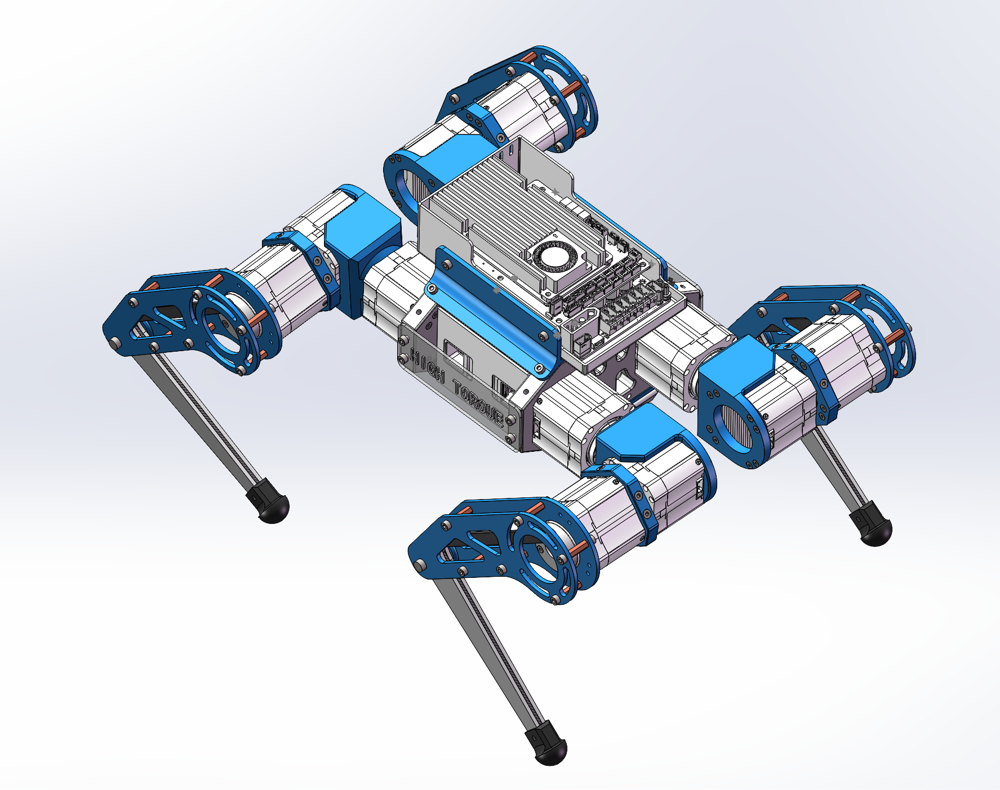

<p align="center">
  
</p>

<h1 align="center">HTDW4438-OpenDog</h1>

<p align="center">
  <b>English</b> | <a href="README.md">简体中文</a>
</p>

<p align="center">
  Full-stack open-source quadruped: Mechanics/URDF → Isaac Gym RL training → Sim2Real deployment
</p>

<p align="center">
  <a href="#repository-layout">Repo</a> ·
  <a href="https://github.com/Lain-Ego0/HTDW4438_Isaacgym">Training</a> ·
  <a href="https://github.com/Lain-Ego0/LeggedWiki">LeggedWiki</a> ·
  <a href="#reference-platform-hightorque-htm5046">HighTorque HTM5046</a>
</p>

---

## Contents

- [Overview](#overview)
- [Highlights](#highlights)
- [Gallery](#gallery)
- [Repository Layout](#repository-layout)
- [Related Repos](#related-repos)
- [Quick Start](#quick-start)
- [Reference Platform: HighTorque HTM5046](#reference-platform-hightorque-htm5046)
- [Acknowledgements](#acknowledgements)

## Overview

**HTDW4438-OpenDog** is a full-stack open-source quadruped robot project, covering the workflow from mechanical design & URDF modeling to reinforcement learning (RL) locomotion control, plus Sim2Real deployment utilities.

This project is a focused iteration/adaptation based on the open-source **HighTorque (高擎机电) HTM5046** platform (structure/URDF/training & deployment pipeline).

## Highlights

- **Agile locomotion**: Inspired by ideas such as **HIMloco** (Hybrid Internal Model) and related works.
- **High-performance training**: GPU-accelerated RL training based on **NVIDIA Isaac Gym**.
- **Sim-to-Real**: Ships with `livelybot_sdk` and helper scripts for deployment to real hardware.
- **Docs & knowledge base**: Companion wiki/repo to speed up onboarding and troubleshooting.

## Gallery

<p align="center">
  
  
  
</p>

## Repository Layout

```text
HTDW4438-OpenDog
├── 1.Hardware/               # Mechanical files, URDF, meshes
│   └── htdw_4438/             # URDF package (meshes/, urdf/, launch/)
├── 2.Software/
│   └── livelybot_sdk/         # Motor control & communication SDK (scripts included)
├── 3.Document/                # BOM, manuals, STEP resources
├── 4.Paper/                   # Reference papers (HIMloco, etc.)
├── 5.Images/                  # Project renders
└── assets/                    # README assets
```

## Related Repos

- **Training framework (Isaac Gym)**: [HTDW4438_Isaacgym](https://github.com/Lain-Ego0/HTDW4438_Isaacgym)
- **Companion knowledge base**: [LeggedWiki](https://github.com/Lain-Ego0/LeggedWiki)
- **Technical notes (Feishu Wiki)**: <https://wcn9j5638vrr.feishu.cn/wiki/space/757098375279517715>

## Quick Start

### 1) URDF

- URDF: `1.Hardware/htdw_4438/urdf/htdw_4438.urdf`
- Meshes: `1.Hardware/htdw_4438/meshes/`
- Gazebo/RViz launch files: `1.Hardware/htdw_4438/launch/`

### 2) RL Training (recommended: follow the training repo)

Training/deployment code lives in: [HTDW4438_Isaacgym](https://github.com/Lain-Ego0/HTDW4438_Isaacgym).

Minimal environment setup example (please follow the training repo README as the source of truth):

```bash
git clone https://github.com/Lain-Ego0/HTDW4438_Isaacgym.git
cd HTDW4438_Isaacgym
conda env create -f HTDW4438.yml
conda activate HTDW4438
pip install -e rsl_rl
pip install -e legged_gym
```

### 3) Real-robot SDK & scripts

- SDK location: `2.Software/livelybot_sdk/`
- Common scripts:
  - `2.Software/livelybot_sdk/motor_set_zero.sh` (motor calibration/zeroing)
  - `2.Software/livelybot_sdk/canboard_update.sh` (CAN board firmware update)
  - More details: `2.Software/livelybot_sdk/readme.md`

> Note: Before powering motors and running calibration, lift the robot off the ground and verify E-stop/limits to avoid damage due to unexpected motion.

## Reference Platform: HighTorque HTM5046

- HighTorque official site: <https://www.hightorque.cn/>
- HighTorque (EN): <https://www.hightorquerobotics.com/>
- Open-source downloads: <https://www.hightorque.cn/ziliaoxiazai/sizujqrosxz.html>
- The official open-source package typically includes: 3D files (STEP), hardware files (engineering & Gerber), software (SDK & firmware), and motion control resources (URDF).

<p align="center">
  
</p>

## Acknowledgements

- Open-source baseline: HighTorque HTM5046
- Locomotion & RL references: `4.Paper/` (HIMloco, etc.)
- RL training toolchain: `HTDW4438_Isaacgym`
- Knowledge & notes: `LeggedWiki`
